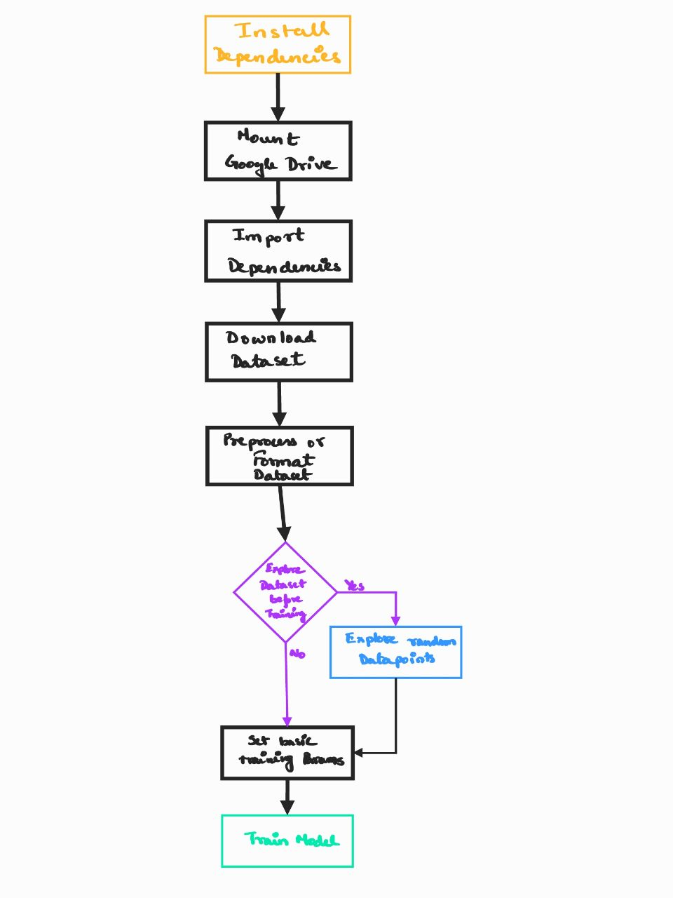

# Vehicle Dent Detection Low Level Design(Training)

## Flow Diagram

## Dependencies

| Packages/Repos | version | Reason                                                                                      |
| -------------- | ------- | ------------------------------------------------------------------------------------------- |
| torch          | 1.5     | Required by Detectrono2                                                                     |
| torchvision    | 0.6     | Required for basic utilities to aid Object Detection                                        |
| opencv         | any     | For data visualization and for reading images and videos and drawing mask over video output |
| numpy          | any     | Basic utility for mathematical operations                                                   |
| detectron2     |         | Main object detection implementation framework                                              |
| coco dataset   |         | Pre-trained model used coco dataset for training                                            |
| R_50_FPN_3x    |         | Base model used for object detection                                                        |

## Design

There are multiple steps involved in the process of creating and training the model.

### Step1: Data Collection and Annotation

We initially started with only 400 images of "car" type vehicle and manually annotated the images using 'LabelMe'. Initial model was coded in Tensorflow 1.x so the ''LabelMe' annotated images were useful directly.

Later on more data was acquired from Kaggle's data source which had over 800 more images of dented cars. These images were annotated using an sem-automation tool called Darwin.

Later the combination of both the image dataset was used on the 2nd model, i.e. a total of 1200 annotated images. The images annotated using Darwin didn't follow the CoCo dataset format and so a separate script was used to convert the annotated json files into the specific format before being used for training the model.

**Note: All the data contained in the above mentioned datasets only consists of car images and no other vehicle images were included due to lack of variations in damage form with regards to other vehicles. But we expect that the model trained on car images will also work with very less tinkering on other forms of vehicles as well.**

- **Total Data Sources:** 2
  
     - Web Scrapped (initial 400 images) [[Source(data with annotation)](https://drive.google.com/drive/folders/1UEXMt9gc8wk44DOFE4CyKbvrG9J8X7I9?usp=sharing)]
  
     - Kaggle Datasource (additional 800 images) [[Datasource](https://storage.googleapis.com/bucket-8732/car_damage/preprocessed.zip), [Annotations](https://drive.google.com/file/d/1-OSmUR5Ef66-OMuFdINLepmZMcbgoeNE/view?usp=sharing)]

- **Annotation tools used:** 2
  
     - `LabelMe` manual automation tool
  
     - `Darwin` semi-automation tool which required a python script to convert annotated files to required format 

- **Dataset Annotation Standard Format:** CoCo dataset format

## Step2: Data Preprocessing and Augmentation

Most of the data preprocessing and augmentation is handled by the base model's preprocessing pipeline. We just feed the model with the images and the properly coco standard formatted annotation file in json format.

As per the Tensorflow 1.x and Detectron2 base model, the images are first cropped and then resized so as to meet the base CNN model's input requirement. As mentioned, this step is handled by the model's preprocessing pipeline.

For data augmentation we used only 2 types of augmentation

- vertical flip

- rotation

This was also handled by the base model's input pipeline.

**Note: To reduce the time spent on downloading the dataset into the google colab environment and after that training it, we stored the dataset in Google Drive and mounted the drive into the Google Colab notebook environment so that less time is spent in copying the dataset.**

## Step3: Model Creation

Initially the model was created using Tensorflow(ver: 1.x). But the model didn't perform as per the expectations. After some research we shifted to Detectron2 which uses pytorch as the base framework.

The base CNN model used for classification is `R_50_FPN_3x` and the Object detection model used is `Masked_RCNN`.

Total number of models tried:

- Masked RCNN 
  
     - various base models
  
     - Tensorflow 1.x

- Masked RCNN
  
     - R_50_FPN_3x as the base  model
  
     - Detectron2 (pytorch as backend)

## Step4: Model Training

The recent model (masked rcnn implemented using detectron) was trained using the default hyperparameters on the training data using 80% of the total data and 20% as the validation data. It was trained on 60,000 epochs with 512 images as the batch size. The learning rate was initialized with 0.005.

Any number of epochs more than 60,000 gave more false positives thus decreasing the accuracy.

The model was coded in Google Colab notebook and was trained on it utilizing the free tier(max 12hours of training).

- **Model Implementation Framework:** Detectron 2

- **Model:** Masked RCNN

- **Hyperparameters:** default hyperparameter selection done by the implementation

- **Train/Validation split of total data source:** 80%-20%

- **Learning Rate:** 0.005

- **Batch Size:** 512

- **Epochs:** 60,000 

## Step5: Storing the Model

The model was stored in the Google Drive. During the training the model is configured in such a way that after each 10,000 epochs of training the model is check-pointed into the google drive. We use the Detectron2 native way for storing the model.
